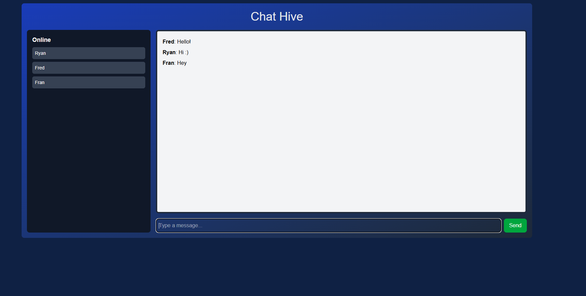

# Chat Hive (MVP 2)

**Chat Hive** is a real-time messaging application built with React, Socket.IO, and hosted on AWS EC2. This app is a work-in-progress, designed to practice and showcase skills in WebSockets, real-time communication, and cloud hosting (AWS). The project is currently in its Minimum Viable Product (MVP) stage, with plans for future enhancements.

## Features (MVP 2)

- Real-time messaging using WebSockets (Socket.IO)
- Users can set a username upon entering the chat
- Messages are displayed with the sender's username
- Simple, clean chat interface with basic functionality
- Online users displayed next to chat

  

## Technologies Used

- **React**: For building the user interface
- **Socket.IO**: For real-time communication between the client and server
- **TypeScript**: For better development experience and type safety
- **AWS EC2**: For hosting the backend server

## AWS EC2 Server

The backend for this application is hosted on an AWS EC2 instance, which handles WebSocket connections and manages real-time messaging. The server is designed to facilitate message sending/receiving but is not yet fully production-ready. 

### Server Details:
- The server is deployed and hosted on an AWS EC2 instance.
- The app communicates with the server for real-time messaging but the server itself is not yet fully optimized for production use.

### Important Notes:
- **This project is in the MVP stage**. It is being developed as part of my portfolio to demonstrate my skills in using WebSockets, AWS, and real-time applications.
- **Users can access and interact with the app through the deployed version** but **the server is not yet fully optimized** for production use.

## How to Use

1. Access the app via the deployed version (URL provided below).
2. You’ll be prompted to enter a username when you open the app.
3. After entering your username, you’ll be connected to the chat.
4. Type your message in the input field and click **Send** to post it to the chat.
5. All users in the chat room will see your message in real-time.
6. To leave the chat, refresh the page.

### Access the Deployed App:

https://chat-2uvg9144s-daniellem62s-projects.vercel.app/

## Project Structure

- **`/components`**: Contains React components like the `Chat` component.
- **`/hooks`**: Contains custom hooks like `useSocket` to handle WebSocket communication.
- **`/pages`**: Contains the main pages of the application.

## Current Status

This project is currently in MVP 1, focusing on:
- Establishing WebSocket communication.
- Implementing a basic chat interface where users can send and receive messages in real time.

Future plans include:
- Adding message persistence (storing chat history).
- Enhancing the UI/UX.
- Improving server-side architecture for scalability and security.
- Adding authentication for users.

## License

This project is a personal portfolio project and is not open for use or modification. It is meant to showcase my skills in real-time applications, WebSockets, and cloud hosting (AWS).

## Contributing

Since this is a personal project designed for learning and showcasing my skills, contributions are not currently accepted. However, feel free to review the code for educational purposes.

## License

This project is licensed under the MIT License - see the [LICENSE](LICENSE) file for details.
